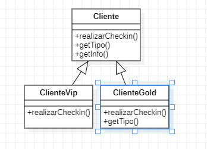

## 3. Padrões comportamentais:

---

### 3.8 Template Method

### 3.8.1 Introdução

Trata-se um padrão de design comportamental que define o esqueleto de um algoritmo na superclasse, mas permite que subclasses substituam etapas específicas do algoritmo sem alterar sua estrutura.

### 3.8.2 Exemplo abordado
Para tal padrão de projeto, implementei um exemplo relacionado

### 3.8.3 Diagrama de Classe do Exemplo
